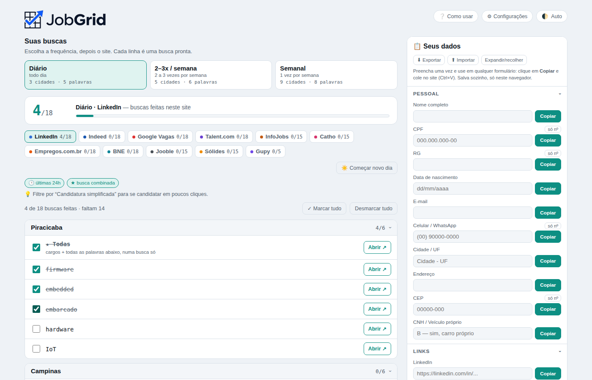
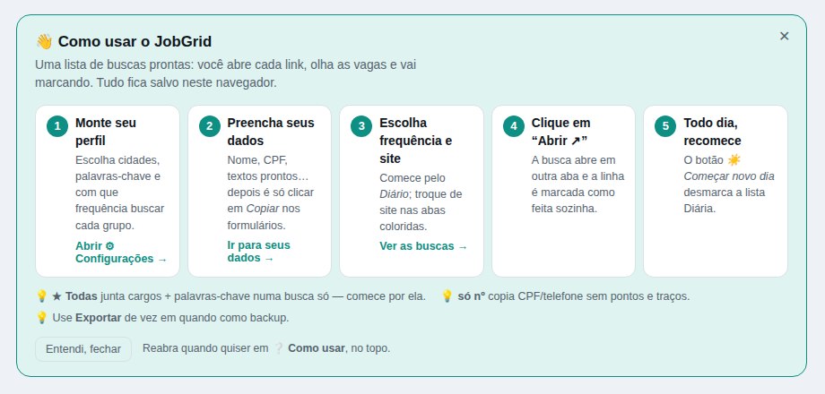
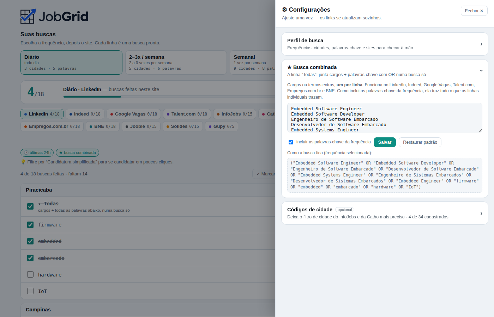

<p align="center">
  <picture>
    <source media="(prefers-color-scheme: dark)" srcset="assets/logo-dark.png">
    
  </picture>
</p>

<p align="center">
  <b>Um painel de buscas de vaga prontas: abra, confira e marque.</b><br>
  Junte LinkedIn, Indeed, Gupy, Catho, InfoJobs e mais numa lista organizada por cidade, palavra-chave e frequência.
</p>

<p align="center">
  
  
  
  
</p>

---

<picture>
  <source media="(prefers-color-scheme: dark)" srcset="assets/screenshot-dark.png">
  
</picture>

## Por que o JobGrid?

Quem procura emprego repete a mesma rotina todo dia: abrir cada site, digitar o cargo, escolher a cidade, lembrar onde já olhou… e depois preencher nome, CPF e "fale sobre você" em todo formulário.

O JobGrid transforma isso numa **lista de links prontos**. Cada linha é uma busca (site × cidade × palavra-chave). Você clica em **Abrir ↗**, confere as vagas e a linha é marcada sozinha. No dia seguinte, um clique recomeça.

## Funcionalidades

- **Buscas prontas em 11 sites.** LinkedIn, Indeed, Google Vagas, Talent.com, InfoJobs, Catho, Empregos.com.br, BNE, Jooble, Sólides e Gupy.
- **Frequências.** Separe as cidades em *Diário*, *2–3x por semana* e *Semanal*, cada uma com suas próprias palavras-chave.
- **★ Busca combinada.** Uma linha "Todas" junta cargos + palavras-chave com `OR` numa busca só, nos sites que aceitam busca booleana.
- **Progresso.** Checklist com contador por site e por cidade, e um botão "☀️ Começar novo dia".
- **Sites para checar à mão.** Portais sem busca por link (prefeituras, comunidades, recrutadoras) numa lista que você mesmo edita.
- **Seus dados para copiar e colar.** Painel lateral com nome, CPF, contatos, experiência, formação e textos prontos. Um clique copia, e o botão "só nº" copia sem pontos e traços.
- **100% configurável na própria página.** Troque cidades (de qualquer estado), palavras-chave, cargos e portais sem mexer no código.
- **Tutorial embutido**, tema claro e escuro, e layout que funciona no celular.
- **Privado.** Nada sai do seu navegador. Exportar/Importar em `.json` serve de backup ou para passar a configuração para outro PC.

## Como usar

### Online (GitHub Pages)

Acesse: **`https://barriviera.github.io/JobGrid/`**

### No seu computador

Baixe o `index.html` e abra no navegador. Não precisa instalar nada.

### Primeiros passos



1. **⚙ Configurações → Perfil de busca:** coloque suas cidades e palavras-chave em cada frequência.
2. **📋 Seus dados:** preencha uma vez as informações que os formulários sempre pedem.
3. Escolha a **frequência** e o **site**, e comece pela linha **★ Todas**.
4. Clique em **Abrir ↗**: a busca abre em outra aba e a linha é marcada.
5. No dia seguinte, clique em **☀️ Começar novo dia**.

> **Dica:** cidades fora de SP usam o formato `Cidade/UF`, por exemplo `Curitiba/PR`.



## Sites suportados

| Site | Busca combinada (★) | Só últimas 24h | Observação |
|---|:---:|:---:|---|
| LinkedIn | ✅ | ✅ | |
| Indeed | ✅ | ✅ | |
| Google Vagas | ✅ | | Junta vagas de vários sites |
| Talent.com | ◐ | ✅ | Booleana funciona parcialmente |
| InfoJobs | | | Usa código de cidade (opcional) |
| Catho | | | Usa código de cidade (opcional) |
| Empregos.com.br | ✅ | | |
| BNE | ✅ | | |
| Jooble | | | Junta vagas de vários sites |
| Sólides | | | |
| Gupy | | | Um link já cobre todas as cidades da frequência |

**Códigos de cidade (InfoJobs e Catho):** sem código, o link usa o nome da cidade e às vezes traz cidades vizinhas. Para ser mais preciso, faça uma busca no site filtrando a cidade, copie o endereço e cole em **⚙ Configurações → Códigos de cidade**. O código é extraído sozinho.

## Privacidade

Tudo (marcações, configurações e dados pessoais) fica no `localStorage` do **seu** navegador. Não há servidor, cadastro nem rastreamento.

⚠️ O `localStorage` é separado por endereço. Se você usava o arquivo local e passou para a versão online (ou trocou de navegador), use **⬇ Exportar** num e **⬆ Importar** no outro.

## Publicar no GitHub Pages

1. Crie o repositório e envie os arquivos (o `index.html` precisa estar na raiz).
2. Vá em **Settings → Pages**.
3. Em *Source*, escolha **Deploy from a branch**, depois a branch `main` e a pasta `/ (root)`.
4. Salve. Em cerca de 1 minuto o site estará em `https://<seu-usuario>.github.io/<nome-do-repo>/`.

## Para desenvolvedores

O projeto é **um único `index.html`** (HTML + CSS + JS puro, sem build nem dependências). As imagens do logo já vão embutidas nele.

### Adicionar um novo site de busca

No `<script>`, acrescente um item ao array `PLATFORMS`:

```js
{ id: "meusite", label: "Meu Site", color: "#123456",
  boolean: false,        // true = ganha a linha "★ Todas"
  buildUrl: function (kw, city, terms, tier) {
    // kw    → palavra-chave da linha
    // city  → "Campinas" ou "Curitiba/PR" (use cn(city) = nome, cu(city) = UF)
    // terms → lista de termos quando for a linha "★ Todas" (senão null)
    return "https://meusite.com/vagas?q=" + encodeURIComponent(kw) +
           "&cidade=" + encodeURIComponent(cn(city));
  } }
```

Se quiser etiquetas e uma dica acima da lista, adicione também uma entrada em `PF_META`.

Outras opções: `multiCity: true` (um link por palavra com todas as cidades da frequência, como na Gupy). Helpers disponíveis: `slug()`, `boolStr()`, `q()`, `ids()`.

### Estrutura

```
.
├── index.html      # o app inteiro
├── assets/         # logos e screenshots usados neste README
└── README.md
```

## Contribuindo

Achou um link que mudou de formato ou quer sugerir um site novo? Abra uma *issue* com um **link de exemplo de busca** (já filtrado por palavra e cidade). Com isso dá para montar o padrão.

Pull requests são bem-vindos.

